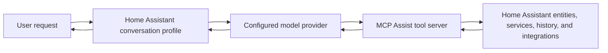

# Architecture

MCP Assist is built around one idea: a model should not need the full Home
Assistant entity list in every prompt. Instead, it should receive a compact
overview and use tools to fetch details only when needed.

## The Problem

Traditional assistant designs often send all exposed entity states to the model
with each request. In larger homes this can mean:

- thousands of tokens before the user request is even considered
- slower responses
- higher cloud-provider cost
- smaller remaining context windows
- worse behavior as entity counts grow

MCP Assist keeps the prompt smaller by exposing Home Assistant through MCP tools.

## Request Flow

At a high level:

1. Home Assistant loads the `mcp_assist` integration.
2. MCP Assist starts a shared MCP server.
3. A conversation profile receives the user request.
4. The model receives compact instructions and the available tool definitions.
5. The model calls tools such as `get_index`, `discover_entities`, or
   `get_entity_details`.
6. MCP Assist reads or changes Home Assistant state through Home Assistant APIs.
7. The model uses the tool result to answer the user.

## Core MCP Server

The MCP server exposes a stable set of core tools:

- indexing and entity discovery
- entity and device details
- action execution through Home Assistant services
- script and automation execution
- conversation continuation state
- optional bridge tools for Assist context

Optional tool families can add more capabilities, such as recorder history,
weather forecasts, memory, web search, URL reading, Wikipedia search, Music
Assistant, images, and external custom tools.

See [Tool Reference](tool-reference.md) for the tool list.

## Smart Entity Index

The Smart Entity Index is a compact snapshot of the Home Assistant structure. It
includes areas, floors, labels, domains, device classes, devices, people,
calendars, zones, automations, scripts, and alias metadata for alias-capable
Home Assistant objects.

The index lets the model decide where to look without receiving every entity
state. A typical flow is:

1. Call `get_index` to understand the home structure.
2. Call `discover_entities` with filters such as area, domain, state, or name.
3. Call `get_entity_details` for exact state and attributes.
4. Call `perform_action` only when a change is needed.

For entities without standardized `device_class` attributes, optional
gap-filling can infer useful categories from naming patterns.

## Entity Exposure

MCP Assist follows Home Assistant's conversation exposure model. Entities must
be exposed to the conversation assistant before the integration can discover or
control them.

To manage exposure:

1. Go to **Settings** -> **Voice Assistants** -> **Expose**.
2. Select the entities the assistant may see or control.
3. Re-test discovery after changing exposure.

For privacy and safety guidance, see [Security and Privacy](security-and-privacy.md).

## Shared Server, Multiple Profiles

MCP Assist supports multiple conversation profiles. Each profile can have its
own provider, model, prompts, conversation settings, and per-profile tool
overrides.

The MCP server itself is shared. Settings such as port, allowed IPs, web search
provider, memory retention, external custom tools, and shared tool-family
defaults apply to all profiles.

See [Configuration](configuration.md#shared-vs-per-profile-tool-settings).

## Token Usage

The exact token count depends on the model provider, enabled tools, prompt
customization, and request. The intended pattern is still consistent:

| Approach | Prompt shape |
| --- | --- |
| Full entity dump | Sends all exposed entity states up front |
| MCP Assist | Sends compact instructions and lets the model discover details on demand |

This is why MCP Assist tends to scale better as Home Assistant installations get
larger.

## Data Boundaries

MCP Assist can only answer from data that is available through Home Assistant,
enabled tool families, configured providers, and exposed entities. It does not
automatically bypass Home Assistant exposure controls, fetch arbitrary URLs
without the relevant tools enabled, or run external custom code unless that
feature is explicitly enabled.
